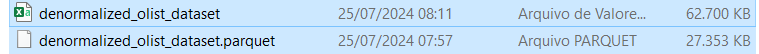
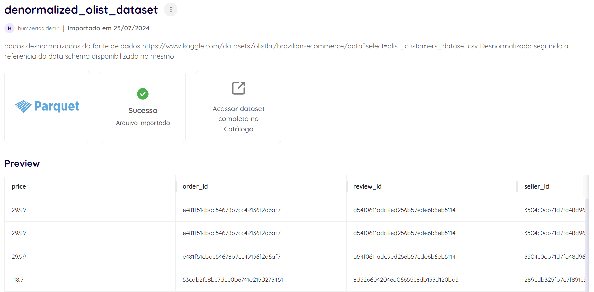

Para o contexto desse case tecnico, optei por  realizar a consolidação de todos esses arquivos, utilizando  a linguagem Python e a biblioteca Pandas, e o script pode ser acessado em:
[merger.py](merger.py)

## Motivo para Consolidar a Fonte de Dados

Consolidar a fonte de dados, juntando vários arquivos CSV em um único arquivo Parquet com colunas mescladas, é uma abordagem estratégica que traz inúmeros benefícios para o projeto de construção da Plataforma de Dados na empresa de e-commerce. Entre os principais benefícios estão:

- **Incremento da Velocidade**: O arquivo Parquet é otimizado para leitura rápida, o que melhora o desempenho em comparação com arquivos CSV.

- **Compactação Eficiente**: O Parquet utiliza técnicas de compactação que diminuem drasticamente o espaço de armazenamento necessário, reduzindo a necessidade de armazenamento em comparação com múltiplos arquivos CSV.

Para ilustrar a eficiência da compactação, consideremos o seguinte exemplo: o arquivo consolidado gerado no formato CSV ocupa um espaço de 62.700KB, enquanto o mesmo arquivo no formato Parquet ocupa apenas 27.353KB, representando uma redução de aproximadamente 56,4% no espaço de armazenamento necessário.

Ativo de dados integrado na dadosfera

[Link para acesso ao arquivo na DadosFera](https://app.dadosfera.ai/pt-BR/collect/import-files/d6c5e72d-b68b-4173-8969-09b1e20541a4)
