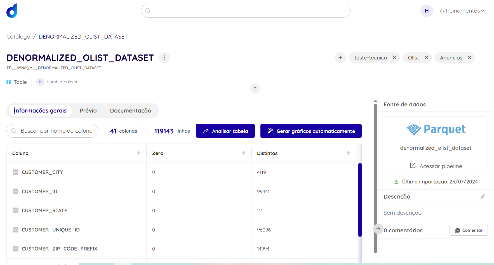

# Dicionario de dados

[Link para acesso ao Data Asset](https://app.dadosfera.ai/pt-BR/catalog/data-assets/b77d1acf-f610-47de-84a4-f7c64ece7a8b)

## Inspirado em:

https://pds.nasa.gov/tools/dd-search/
tm232.pdf (ornl.gov)
-------------------------------------------------------

  

## Coluna: order_id

- Tipo de Dado: String

- Valor de Domínio: UUID único

- Definição/Descrição: Identificador único para cada pedido

- Fonte: Arquivo csv contendo informações de transação da plataforma de e-commerce

- Data de Criação: 2024-07-25

- Última Atualização: 2024-07-25

- Proprietário: Aldemir Humberto Soares Neto

- Regras de Validação: Deve ser um UUID válido, deve ser único

----
## Coluna: customer_id

- Tipo de Dado: String

- Valor de Domínio: UUID único

- Definição/Descrição: Identificador único para cada cliente

- Fonte: Banco de dados de clientes da plataforma de e-commerce

- Data de Criação: 2024-07-25

- Última Atualização: 2024-07-25

- Proprietário: Aldemir Humberto Soares Neto

- Regras de Validação: Deve ser um UUID válido

----
## Coluna: order_status

- Tipo de Dado: String

- Valor de Domínio: ["entregue", "enviado", "processando", "cancelado"- ]

- Definição/Descrição: Status atual do pedid- o

- Fonte: Arquivo csv contendo dados de pedidos da  plataforma de e-commerce

- Data de Criação: 2024-07-25

- Última Atualização: 2024-07-25

- Proprietário: Aldemir Humberto Soares Neto

- Regras de Validação: Deve ser um dos valores de status predefinidos

----
## Coluna: order_purchase_timestamp

- Tipo de Dado: Timestamp

- Valor de Domínio: Data e hora válidas

- Definição/Descrição: Data e hora em que o pedido foi feito

- Fonte: Arquivo csv contendo informações de transação da plataforma de e-commerce

- Data de Criação: 2024-07-25

- Última Atualização: 2024-07-25

- Proprietário: Aldemir Humberto Soares Neto

- Regras de Validação: Deve ser um timestamp válido, não pode estar no futuro

----
## Coluna: order_approved_at

- Tipo de Dado: Timestamp

- Valor de Domínio: Data e hora válidas

- Definição/Descrição: Data e hora em que o pedido foi aprovado

- Fonte: Arquivo csv contendo dados de pedidos da plataforma de e-commerce

- Data de Criação: 2024-07-25

- Última Atualização: 2024-07-25

- Proprietário: Aldemir Humberto Soares Neto

- Regras de Validação: Deve ser um timestamp válido, deve ser posterior ao order_purchase_timestamp

----
## Coluna: order_delivered_carrier_date

- Tipo de Dado: Timestamp

- Valor de Domínio: Data e hora válidas

- Definição/Descrição: Data e hora em que o pedido foi entregue à transportadora

- Fonte: Arquivo csv contendo informações de logística da plataforma de e-commerce

- Data de Criação: 2024-07-25

- Última Atualização: 2024-07-25

- Proprietário: Aldemir Humberto Soares Neto

- Regras de Validação: Deve ser um timestamp válido, deve ser posterior ao order_approved_at

----
## Coluna: order_delivered_customer_date

- Tipo de Dado: Timestamp

- Valor de Domínio: Data e hora válidas

- Definição/Descrição: Data e hora em que o pedido foi entregue ao cliente

- Fonte: Arquivo csv contendo informações de logística da plataforma de e-commerce

- Data de Criação: 2024-07-25

- Última Atualização: 2024-07-25

- Proprietário: Aldemir Humberto Soares Neto

- Regras de Validação: Deve ser um timestamp válido, deve ser posterior ao order_delivered_carrier_date

----
## Coluna: order_estimated_delivery_date

- Tipo de Dado: Data

- Valor de Domínio: Data válida

- Definição/Descrição: Data estimada para entrega do pedido

- Fonte: Arquivo csv contendo informações de logística da plataforma de e-commerce

- Data de Criação: 2024-07-25

- Última Atualização: 2024-07-25

- Proprietário: Aldemir Humberto Soares Neto

- Regras de Validação: Deve ser uma data válida, deve ser posterior ao order_purchase_timestamp

----
## Coluna: product_id

- Tipo de Dado: String

- Valor de Domínio: UUID único

- Definição/Descrição: Identificador único para cada produto

- Fonte: Arquivo csv contendo dados de produtos da plataforma de e-commerce

- Data de Criação: 2024-07-25

- Última Atualização: 2024-07-25

- Proprietário: Aldemir Humberto Soares Neto

- Regras de Validação: Deve ser um UUID válido

----
## Coluna: seller_id

- Tipo de Dado: String

- Valor de Domínio: UUID único

- Definição/Descrição: Identificador único para cada vendedor

- Fonte: Arquivo csv contendo dados de vendedores da plataforma de e-commerce

- Data de Criação: 2024-07-25

- Última Atualização: 2024-07-25

- Proprietário: Aldemir Humberto Soares Neto

- Regras de Validação: Deve ser um UUID válido

----
## Coluna: price

- Tipo de Dado: Float

- Valor de Domínio: Número positivo

- Definição/Descrição: Preço do produto

- Fonte: Arquivo csv contendo dados de produtos da plataforma de e-commerce

- Data de Criação: 2024-07-25
- 
- Última Atualização: 2024-07-25
 
- Proprietário: Aldemir Humberto Soares Neto

- Regras de Validação: Deve ser um número positivo
 

----
## Coluna: freight_value

- Tipo de Dado: Float

- Valor de Domínio: Número não negativo

- Definição/Descrição: Custo de frete para o produto

- Fonte: Arquivo csv contendo informações de logística da plataforma de e-commerce

- Data de Criação: 2024-07-25

- Última Atualização: 2024-07-25

- Proprietário: Aldemir Humberto Soares Neto

- Regras de Validação: Deve ser um número não negativo

----
## Coluna: product_category_name

- Tipo de Dado: String

- Valor de Domínio: Nomes de categorias predefinidos

- Definição/Descrição: Categoria do produt- o

- Fonte: Arquivo csv contendo dados de produtos da  plataforma de e-commerce

- Data de Criação: 2024-07-25

- Última Atualização: 2024-07-25

- Proprietário: Aldemir Humberto Soares Neto

- Regras de Validação: Deve ser um dos nomes de categoria predefinidos

----
## Coluna: customer_unique_id

- Tipo de Dado: String

- Valor de Domínio: UUID único

- Definição/Descrição: Identificador único para cada cliente, potencialmente usado em vários pedidos

-  Fonte: Banco de dados de clientes da plataforma de e-commerce

- Data de Criação: 2024-07-25

- Última Atualização: 2024-07-25

- Proprietário: Aldemir Humberto Soares Neto

- Regras de Validação: Deve ser um UUID válido

----
## Coluna: customer_zip_code_prefix

- Tipo de Dado: Inteiro

- Valor de Domínio: Prefixo de CEP válido

- Definição/Descrição: Primeiros cinco dígitos do CEP do cliente

- Fonte: Banco de dados de clientes da plataforma de e-commerce

- Data de Criação: 2024-07-25

- Última Atualização: 2024-07-25

- Proprietário: Aldemir Humberto Soares Neto

- Regras de Validação: Deve ser um prefixo de CEP válido

----
## Coluna: customer_city

- Tipo de Dado: String

- Valor de Domínio: Nomes de cidades válidos

- Definição/Descrição: Cidade onde o cliente está localizado

- Fonte: Banco de dados de clientes da plataforma de e-commerce

- Data de Criação: 2024-07-25

- Última Atualização: 2024-07-25

- Proprietário: Aldemir Humberto Soares Neto

- Regras de Validação: Deve ser um nome de cidade válido

----
## Coluna: customer_state

- Tipo de Dado: String

- Valor de Domínio: Códigos de estado válidos de duas letras

- Definição/Descrição: Estado onde o cliente está localiza- do

- Fonte: Banco de dados de clientes da plataforma de  e-commerce

- Data de Criação: 2024-07-25

- Última Atualização: 2024-07-25

- Proprietário: Aldemir Humberto Soares Neto

- Regras de Validação: Deve ser um código de estado válido de duas letras

----
## Coluna: payment_sequential

- Tipo de Dado: Float

- Valor de Domínio: Inteiro positivo

- Definição/Descrição: Número sequencial do pagamento para o pedido

- Fonte: Arquivo csv contendo informações de pagamento da plataforma de e-commerce

- Data de Criação: 2024-07-25

- Última Atualização: 2024-07-25

- Proprietário: Aldemir Humberto Soares Neto

- Regras de Validação: Deve ser um inteiro positivo

----
## Coluna: payment_type

- Tipo de Dado: String

- Valor de Domínio: ["cartão de crédito", "boleto", "voucher"- ]

- Definição/Descrição: Método de pagamento utilizad- o

- Fonte: Arquivo csv contendo informações de pagamento da plataforma de e-commerce

- Data de Criação: 2024-07-25

- Última Atualização: 2024-07-25

- Proprietário: Aldemir Humberto Soares Neto

- Regras de Validação: Deve ser um dos tipos de pagamento predefinidos

----
## Coluna: payment_installments

- Tipo de Dado: Float

- Valor de Domínio: Inteiro positivo

- Definição/Descrição: Número de parcelas do pagamento

- Fonte: Arquivo csv contendo informações de pagamento da plataforma de e-commerce

- Data de Criação: 2024-07-25

- Última Atualização: 2024-07-25

- Proprietário: Aldemir Humberto Soares Neto

- Regras de Validação: Deve ser um inteiro positivo

----
## Coluna: payment_value

- Tipo de Dado: Float

- Valor de Domínio: Número positivo

- Definição/Descrição: Valor do pagamento

- Fonte: Arquivo csv contendo informações de - pagamento da plataforma de e-commerce

- Data de Criação: 2024-07-25

- Última Atualização: 2024-07-25

- Proprietário: Aldemir Humberto Soares Neto

- Regras de Validação: Deve ser um número positivo, deve corresponder à soma dos preços dos produtos e valores de frete

----
## Coluna: review_id

- Tipo de Dado: String

- Valor de Domínio: UUID único

- Definição/Descrição: Identificador único para cada avaliação

- Fonte: Arquivo csv contendo avaliações da plataforma de e-commerce

- Data de Criação: 2024-07-25

- Última Atualização: 2024-07-25

- Proprietário: Aldemir Humberto Soares Neto

- Regras de Validação: Deve ser um UUID válido, deve ser único

----
## Coluna: review_score

- Tipo de Dado: Float

- Valor de Domínio: [1.0, 2.0, 3.0, 4.0, 5.0]

- Definição/Descrição: Pontuação dada na avaliação

- Fonte: Arquivo csv contendo avaliações da - plataforma de e-commerce

- Data de Criação: 2024-07-25

- Última Atualização: 2024-07-25

- ----
## Coluna: review_comment_title
- 
- Tipo de Dado: String

- Valor de Domínio: Qualquer texto

- Definição/Descrição: Título do comentário da avaliação

- Fonte: Arquivo csv contendo avaliações da plataforma de e-commerce

- Data de Criação: 2024-07-25

- Última Atualização: 2024-07-25

- Proprietário: Aldemir Humberto Soares Neto

- Regras de Validação: Campo opcional, pode ser nulo

----
## Coluna: review_comment_message

- Tipo de Dado: String

- Valor de Domínio: Qualquer texto

- Definição/Descrição: Mensagem principal da avaliação

- Fonte: Arquivo csv contendo avaliações da plataforma de e-commerce

- Data de Criação: 2024-07-25

- Última Atualização: 2024-07-25

- Proprietário: Aldemir Humberto Soares Neto

- Regras de Validação: Campo opcional, pode ser nulo

----
## Coluna: review_creation_date

- Tipo de Dado: Data

- Valor de Domínio: Data válida

- Definição/Descrição: Data em que a avaliação foi criada

- Fonte: Arquivo csv contendo avaliações da plataforma de e-commerce

- Data de Criação: 2024-07-25

- Última Atualização: 2024-07-25

- Proprietário: Aldemir Humberto Soares Neto

- Regras de Validação: Deve ser uma data válida, não pode estar no futuro

----
## Coluna: review_answer_timestamp

- Tipo de Dado: Timestamp

- Valor de Domínio: Data e hora válidas

- Definição/Descrição: Data e hora em que a avaliação foi respondida

- Fonte: Arquivo csv contendo avaliações da plataforma de e-commerce

- Data de Criação: 2024-07-25

- Última Atualização: 2024-07-25

- Proprietário: Aldemir Humberto Soares Neto

- Regras de Validação: Deve ser um timestamp válido, deve ser posterior à review_creation_date

----
## Coluna: order_item_id

- Tipo de Dado: Float

- Valor de Domínio: Inteiro positivo

- Definição/Descrição: Identificador para cada item dentro de um pedido

- Fonte: Arquivo csv contendo dados de pedidos da plataforma de e-commerce

- Data de Criação: 2024-07-25

- Última Atualização: 2024-07-25

- Proprietário: Aldemir Humberto Soares Neto

- Regras de Validação: Deve ser um inteiro positivo

----
## Coluna: shipping_limit_date

- Tipo de Dado: Timestamp

- Valor de Domínio: Data e hora válidas

- Definição/Descrição: Prazo para o vendedor enviar o produto

- Fonte: Arquivo csv contendo dados de pedidos da plataforma de e-commerce

- Data de Criação: 2024-07-25

- Última Atualização: 2024-07-25

- Proprietário: Aldemir Humberto Soares Neto

- Regras de Validação: Deve ser um timestamp válido, deve ser posterior ao order_purchase_timestamp

----
## Coluna: product_name_lenght

- Tipo de Dado: Float

- Valor de Domínio: Inteiro não negativo

- Definição/Descrição: Número de caracteres no nome do produto

- Fonte: Arquivo csv contendo dados de produtos da plataforma de e-commerce

- Data de Criação: 2024-07-25

- Última Atualização: 2024-07-25

- Proprietário: Aldemir Humberto Soares Neto

- Regras de Validação: Deve ser um inteiro não negativo

----
## Coluna: product_description_lenght

- Tipo de Dado: Float

- Valor de Domínio: Inteiro não negativo

- Definição/Descrição: Número de caracteres na descrição do produto

- Fonte: Arquivo csv contendo dados de produtos da plataforma de e-commerce

- Data de Criação: 2024-07-25

- Última Atualização: 2024-07-25

- Proprietário: Aldemir Humberto Soares Neto

- Regras de Validação: Deve ser um inteiro não negativo
----
## Coluna: product_photos_qty

- Tipo de Dado: Float

- Valor de Domínio: Inteiro não negativo

- Definição/Descrição: Número de fotos do produto

- Fonte: Arquivo csv contendo dados de produtos da plataforma de e-commerce

- Data de Criação: 2024-07-25

- Última Atualização: 2024-07-25
 
- Proprietário: Aldemir Humberto Soares Neto

- Regras de Validação: Deve ser um inteiro não - negativo

----
## Coluna: product_weight_g

- Tipo de Dado: Float

- Valor de Domínio: Número positivo

- Definição/Descrição: Peso do produto em gramas

- Fonte: Arquivo csv contendo dados de produtos da plataforma de e-commerce

- Data de Criação: 2024-07-25
- Última Atualização: 2024-07-25
- Proprietário: Aldemir Humberto Soares Neto
- Regras de Validação: Deve ser um número positivo

----
## Coluna: product_length_cm

- Tipo de Dado: Float

- Valor de Domínio: Número positivo

- Definição/Descrição: Comprimento do produto em centímetros

- Fonte: Arquivo csv contendo dados de produtos da plataforma de e-commerce

- Data de Criação: 2024-07-25

- Última Atualização: 2024-07-25

- Proprietário: Aldemir Humberto Soares Neto

- Regras de Validação: Deve ser um número positivo

----
## Coluna: product_height_cm

- Tipo de Dado: Float

- Valor de Domínio: Número positivo

- Definição/Descrição: Altura do produto em centímetros

- Fonte: Arquivo csv contendo dados de produtos da plataforma de e-commerce

- Data de Criação: 2024-07-25

- Última Atualização: 2024-07-25

- Proprietário: Aldemir Humberto Soares Neto

- Regras de Validação: Deve ser um número positivo

----
## Coluna: product_width_cm

- Tipo de Dado: Float

- Valor de Domínio: Número positivo

- Definição/Descrição: Largura do produto em centímetros

- Fonte: Arquivo csv contendo dados de produtos da plataforma de e-commerce

- Data de Criação: 2024-07-25

- Última Atualização: 2024-07-25

- Proprietário: Aldemir Humberto Soares Neto

- Regras de Validação: Deve ser um número positivo

----
## Coluna: seller_zip_code_prefix

- Tipo de Dado: Float

- Valor de Domínio: Prefixo de CEP válido

- Definição/Descrição: Primeiros cinco dígitos do CEP do vendedor

- Fonte: Arquivo csv contendo dados de vendedores da plataforma de e-commerce

- Data de Criação: 2024-07-25

- Última Atualização: 2024-07-25

- Proprietário: Aldemir Humberto Soares Neto

- Regras de Validação: Deve ser um prefixo de CEP válido

----
## Coluna: seller_city

- Tipo de Dado: String

- Valor de Domínio: Nomes de cidades válidos

- Definição/Descrição: Cidade onde o vendedor está localizado

- Fonte: Arquivo csv contendo dados de vendedores da plataforma de e-commerce

- Data de Criação: 2024-07-25

- Última Atualização: 2024-07-25

- Proprietário: Aldemir Humberto Soares Neto

- Regras de Validação: Deve ser um nome de cidade válido

----
## Coluna: seller_state

- Tipo de Dado: String

- Valor de Domínio: Códigos de estado válidos de duas letra- s

Definição/Descrição: Estado onde o vendedor está localiza- do

Fonte: Arquivo csv contendo dados de vendedores da - plataforma de e-commerce

- Data de Criação: 2024-07-25

- Última Atualização: 2024-07-25

- Proprietário: Aldemir Humberto Soares Neto

- Regras de Validação: Deve ser um código de estado válido de duas letras