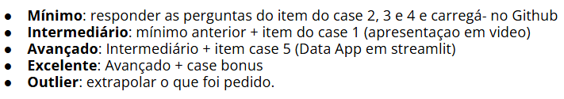

Primeira dificuldade foi no entendimento da ordem de itens a serem realizados

Acredito que se tivesse escrito como 
Mínimo: responder as perguntas dos itens 2, 3 e 4 do case proposto e carregá-los no Github
Intermediário: mínimo anterior + item 10 do case proposto (apresentaçao em video)
Avançado: Intermediário + item 9 (Data App em streamlit)
Excelente: Avançado + case bonus
Outlier: extrapolar o que foi pedido.

seria melhor

