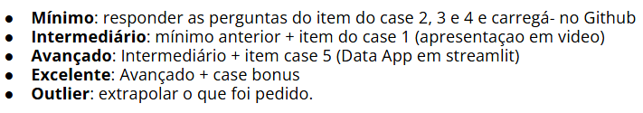
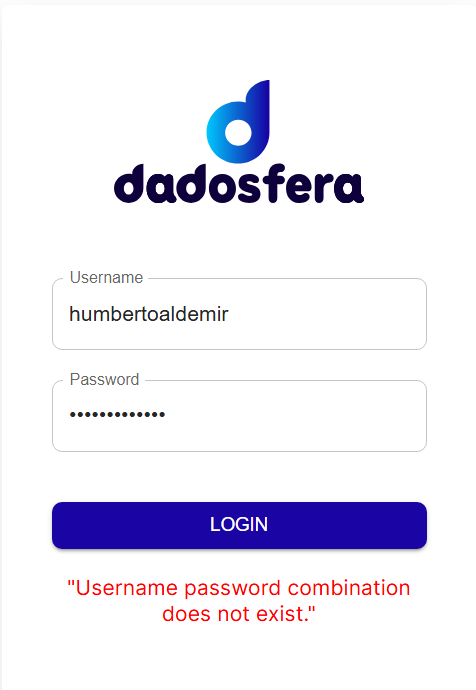

Primeira dificuldade foi no entendimento da ordem de itens a serem realizados

Acredito que se tivesse escrito como 
Mínimo: responder as perguntas dos itens 2, 3 e 4 do case proposto e carregá-los no Github
Intermediário: mínimo anterior + item 10 do case proposto (apresentaçao em video)
Avançado: Intermediário + item 9 (Data App em streamlit)
Excelente: Avançado + case bonus
Outlier: extrapolar o que foi pedido.

seria melhor

Não consegui acesso ao modulo de inteligência usando as mesmas credenciais cadastradas

Tentando utilizar a biblioteca soda-core e seguindo o exemplo disponível no repositório oficial
[exemplo](https://github.com/sodadata/soda-core/blob/main/examples/pandas_dask_example.py)

Encontrei um problema ao executar o comando execute() da classe Scan, ao investigar, pude ver que o problema já estava documentado em formato de issue no repositório:
[issue](https://github.com/sodadata/soda-core/issues/2073)
